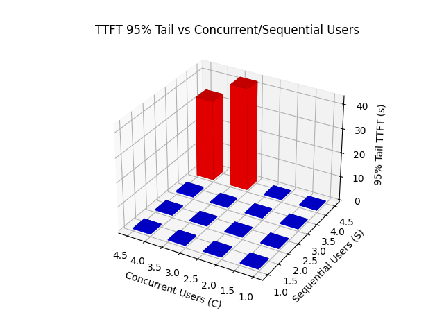
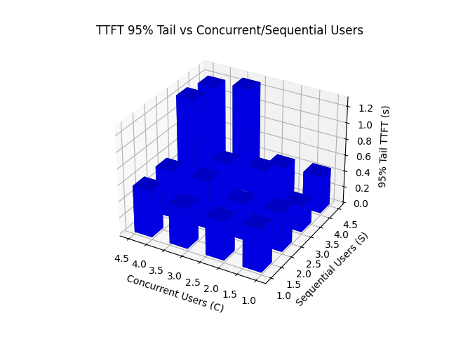

# Real Multi-Round QA Benchmark

## Overview

This benchmark is designed to identify **the maximum number of user sessions ($C\times S$) that can be kept active while maintaining a steady-state TTFT ≤ 2 s (95-th percentile)**. By sweeping the concurrency (C) and sequential (S) independently, it isolates whether compute capacity or KV-cache pressure is the first limiting factor.

We highly recommend monitoring vLLM/LMCache/GPU/storage metrics at the same time.

This benchmark feeds full‑length novels to your LLM server and asks many follow‑up questions, just like a book critic. It is handy for testing long‑context handling and KV‑cache tools such as LMCache.

## Two simple knobs

| Option | What it means |
| ---- | ---- |
| `--num-users-concurrent` (C) | How many threads run in parallel.  |
| `--num-users-sequential` (S) | How many users each thread serves in turn. |

You can:
* raise concurrent to test compute-side capability (higher GPU utilization; total KV footprint also rises).
* raise sequential to test KV-cache pressure (larger resident KV per GPU, little change in instantaneous GPU utilization).

## Execution model

```
Concurrent USER: {A,B}
Sequential USER: {X,Y}
All USER: {AX,AY,BX,BY}

Timeline
-------------------------------------------------
Thread A:
  Turn 0 → UserAX: Q1 "Read and summarize this novel. {AX novel contents}" → Get Response
  Turn 0 → UserAY: Q1 "Read and summarize this novel. {AY novel contents}" → Get Response
  Turn 1 → UserAX: Q2 "Write down the author's feelings." → Get Response
  Turn 1 → UserAY: Q2 "Write down the author's feelings." → Get Response
  ...
Thread B:
  Turn 0 → UserBX: Q1 "Read and summarize this novel. {BX novel contents}" → Get Response
  Turn 0 → UserBY: Q1 "Read and summarize this novel. {BY novel contents}" → Get Response
  Turn 1 → UserBX: Q2 "Write down the author's feelings." → Get Response
  Turn 1 → UserBY: Q2 "Write down the author's feelings." → Get Response
  ...
```

## Getting Started

```bash
# download the novels in the gutenberg dir.
python prepare.py --output data --model Qwen/Qwen2.5-7B-Instruct-1M # Models used in the benchmark
```

```bash
# Run the benchmark many times
BASE_URL="http://localhost:8000/v1"
MODEL="Qwen/Qwen2.5-7B-Instruct-1M"
NUM_ROUNDS=3
OUTPUT_DIR="bench_dir"
SRC_DIR="./data/128k"
mkdir -p "$OUTPUT_DIR"

for c in {1..4}; do # You can change c and s to any value you like.
  for s in {1..4}; do
    TIMESTAMP=$(date +%s)
    OUTPUT_FILE="${OUTPUT_DIR}/bench_c${c}_s${s}_${TIMESTAMP}.json"
    echo "Running benchmark: concurrent=${c}, sequential=${s}"
    python multi-round-qa.py --num-users-concurrent "$c" --num-users-sequential "$s" --num-rounds "$NUM_ROUNDS" --model "$MODEL" --base-url "$BASE_URL" --output "$OUTPUT_FILE" --src-dir "$SRC_DIR"
  done
done
```

```bash
# Plot and Show Result
$ python plot.py ./bench_dir_vllm vllm.png
    num_users_concurrent  num_users_sequential    ttft_95
0                      4                     2   0.498404
1                      4                     4  33.565437
2                      4                     3   0.794144
3                      1                     4   0.311046
4                      2                     2   0.406148
5                      2                     4   0.459704
6                      2                     3   0.326396
7                      1                     2   0.411317
8                      3                     3   0.378674
9                      2                     1   0.445499
10                     3                     4  42.531053
11                     1                     3   0.455651
12                     4                     1   0.504505
13                     3                     2   0.393902
14                     3                     1   0.364927
15                     1                     1   0.379049
Max (C x S) where TTFT_95 <= 2s: 12
  => C=4.0, S=3.0
$ python plot.py ./bench_dir_lmcache lmcache.png
    num_users_concurrent  num_users_sequential   ttft_95
0                      1                     1  0.524989
1                      3                     2  0.592148
2                      4                     4  1.202544
3                      3                     4  1.286755
4                      2                     1  0.477370
5                      3                     3  0.586793
6                      2                     3  0.627655
7                      4                     1  0.575724
8                      4                     3  1.251918
9                      2                     4  0.446477
10                     1                     4  0.460711
11                     3                     1  0.495073
12                     1                     3  0.329389
13                     4                     2  0.586223
14                     1                     2  0.477946
15                     2                     2  0.457463
Max (C x S) where TTFT_95 <= 2s: 16
  => C=4.0, S=4.0
```

LMCache allows 1.3x increase in the number of user sessions kept active at least.

Note: LMCache has not yet reached its limit in this case,
so we can aim to further improve the score by changing C and S.

## Viz

vllm.png



lmcache.png


