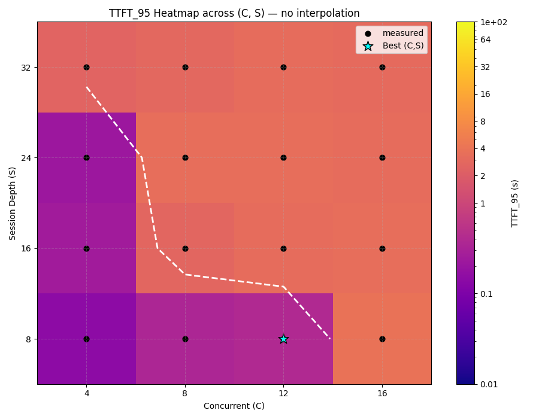
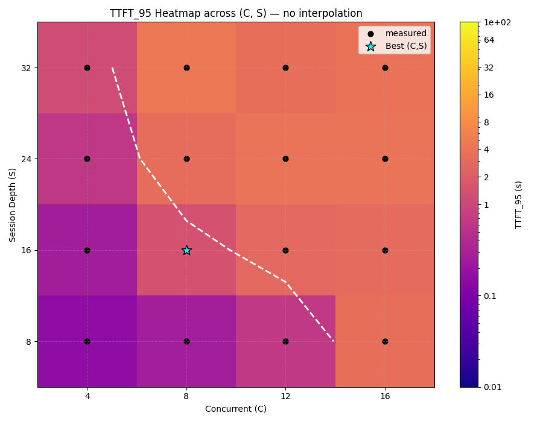

# CxS: Real Multi-Round QA Benchmark

## Overview

This benchmark is designed to explore how TTFT changes across different $(C, S)$ combinations by sweeping concurrency ($C$) and session depth ($S$) independently. This helps isolate whether compute capacity or KV-cache pressure is the primary limiting factor.

We highly recommend monitoring vLLM/LMCache/GPU/storage metrics at the same time. The JSON output from the benchmark includes metrics from vLLM/LMCache.

This benchmark feeds full‑length novels to your LLM server and asks many follow‑up questions, just like a book critic. It is handy for testing long‑context handling and KV‑cache tools such as LMCache.

The benchmark is called CxS (pronounced six for simplicity), referring to the product of Concurrent $\times$ Session Depth.

## Two simple knobs

| Option | What it means |
| ---- | ---- |
| `--concurrent` (C) | How many threads run in parallel.  |
| `--session-depth` (S) | How many sessions each thread serves in turn. |

You can:
* raise $C$ to test compute-side capability (higher GPU utilization; total KV footprint also rises).
* raise $S$ to test KV-cache pressure (larger resident KV per GPU, little change in instantaneous GPU utilization).

## Execution model

```
Concurrent: {A,B}
Session Depth: {X,Y}
All Session: {AX,AY,BX,BY}

Timeline
-------------------------------------------------
Thread A:
  Turn 0 → SessionAX: Q1 "Read and summarize this novel. {AX novel contents}" → Get Response
  Turn 0 → SessionAY: Q1 "Read and summarize this novel. {AY novel contents}" → Get Response
  Turn 1 → SessionAX: Q2 "Write down the author's feelings." → Get Response
  Turn 1 → SessionAY: Q2 "Write down the author's feelings." → Get Response
  ...
Thread B:
  Turn 0 → SessionBX: Q1 "Read and summarize this novel. {BX novel contents}" → Get Response
  Turn 0 → SessionBY: Q1 "Read and summarize this novel. {BY novel contents}" → Get Response
  Turn 1 → SessionBX: Q2 "Write down the author's feelings." → Get Response
  Turn 1 → SessionBY: Q2 "Write down the author's feelings." → Get Response
  ...
```

## For system competition

The CxS benchmark provides a scalar score to encourage healthy competition, but its use is not mandatory.

### Definition

Let us define the set of candidate pairs:

$$
\mathcal{D} = {\{ (C_i, S_i) \mid \mathrm{TTFT}_{95}^{(i)} \leq 2 \}}
$$

### Objective

More precisely, we aim to find the pair that maximizes the harmonic mean among all candidates in $\mathcal{D}$:


$$
\underset{(C_i, S_i) \in \mathcal{D}}{\arg\max} \left( \frac{2 C_i S_i}{C_i + S_i} \right)
$$

## For business metric

As a business metric, we report the product, CxS.  
For example, we say "Our system can keep up to {C×S} user sessions active!"

## Getting Started

```bash
# download the novels in the gutenberg dir.
python prepare.py --output data --model Qwen/Qwen2.5-7B-Instruct-1M # Models used in the benchmark
```

```bash
# Run the benchmark many times
BASE_URL="http://localhost:8000"
MODEL="Qwen/Qwen2.5-7B-Instruct-1M"
NUM_ROUNDS=12
OUTPUT_DIR="bench_dir"
SRC_DIR="./data/128k"
mkdir -p "$OUTPUT_DIR"

for c in {1..4}; do # You can change c and s to any value you like.
  for s in {1..4}; do
    TIMESTAMP=$(date +%s)
    OUTPUT_FILE="${OUTPUT_DIR}/bench_c${c}_s${s}_${TIMESTAMP}.json"
    echo "Running benchmark: C=${c}, S=${s}"
    python multi-round-qa.py -c "$c" -s "$s" --num-rounds "$NUM_ROUNDS" --model "$MODEL" --base-url "$BASE_URL" --output "$OUTPUT_FILE" --src-dir "$SRC_DIR"
  done
done
```

We compare two systems for demo:

System A
* Model
  * Qwen/Qwen2.5-7B-Instruct-1M
* Dataset
  * 32k
* CPU/GPU
  * NVIDIA GH200 480GB
* vLLM
  * v0.9.0.1
  * enable prefix-caching
  * enable chunked prefill
* LMCache 
  * local_cpu: True
  * max_local_cpu_size: 200
  * pipelined_backend: True
  * save_decode_cache: True

System B
* Model
  * Qwen/Qwen2.5-7B-Instruct-1M
* Dataset
  * 32k
* CPU/GPU
  * NVIDIA GH200 480GB
* vLLM
  * v0.9.0.1
  * enable prefix-caching
  * enable chunked prefill
* LMCache 
  * local_cpu: True
  * max_local_cpu_size: 200
  * pipelined_backend: True
  * save_decode_cache: True
  * local_disk: file:///data/tmp
  * max_local_disk_size: 400
* Storage
  * DDN EXAScaler 2.14.0
  * stripe count is 8
  * stripe size is 1MiB

```bash
# Plot and Show Result
$ python plot.py lmcache_bench_dir-1749973344 lmcache_with_cpu_200g.png
     c   s   ttft_95
0    8  16  2.674693
1   12  32  3.268448
2    4  32  2.496206
3   16  16  3.310291
4    4   8  0.146159
5    8  32  2.801732
6   12  24  3.283783
7   12  16  3.185047
8   12   8  0.390896
9    4  24  0.217809
10  16   8  3.799740
11   8   8  0.347083
12  16  24  3.171192
13  16  32  3.032414
14   8  24  3.383691
15   4  16  0.253737
Best (C,S) with TTFT_95 ≤ 2 s → C=12.0, S=8.0, HarmonicMean=9.60, C×S=96.0
Saved: lmcache_with_cpu_200g.png
$ python plot.py lmcache_bench_dir-1749897431 lmcache_with_cpu_200g_exa_400g.png 
     c   s   ttft_95
0    4  16  0.255378
1    8  24  3.213307
2   16  24  4.067904
3    4  24  0.612876
4    8  32  4.389398
5    4   8  0.158686
6   12  24  3.939205
7   12   8  0.634048
8    4  32  1.191106
9   12  32  3.475115
10  16  16  3.156051
11   8   8  0.264291
12  12  16  2.739532
13  16  32  3.853057
14   8  16  1.424959
15  16   8  3.470811
Best (C,S) with TTFT_95 ≤ 2 s → C=8.0, S=16.0, HarmonicMean=10.67, C×S=128.0
Saved: lmcache_with_cpu_200g_exa_400g.png
```
This result shows that adding external storage (DDN EXAScaler) as a tier in the KV cache can increase the number of active sessions.

## Viz

The white dashed line indicates the TTFT = 2s boundary.

System A result:



System B result:


